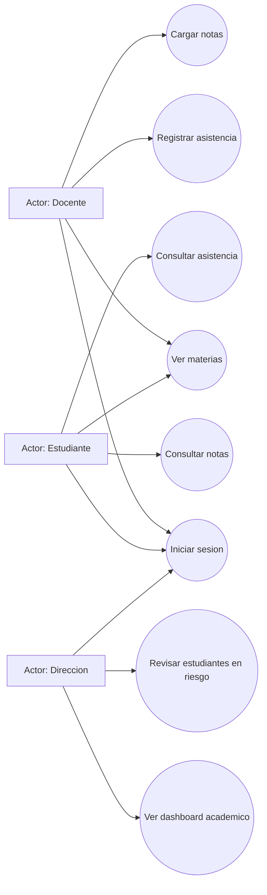
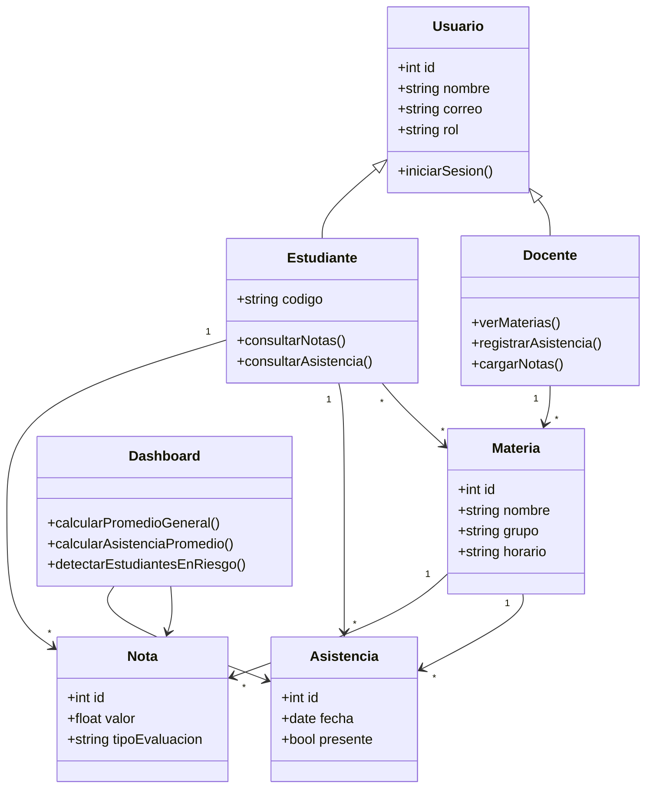
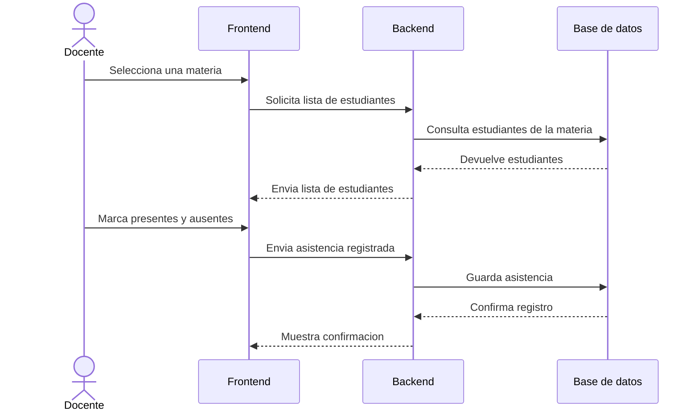
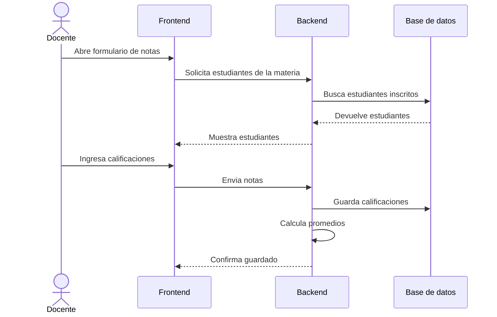
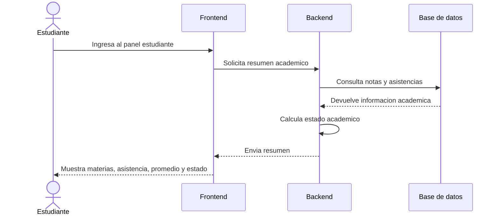

# Metodologia de desarrollo y diagramas del sistema SmartCampus

## Nombre del proyecto

SmartCampus: Sistema de gestion academica.

## Metodologia elegida

Para el proyecto SmartCampus se eligio la metodologia hibrida **Scrumban**, que combina Scrum y Kanban.

Se eligio esta metodologia porque el equipo necesita planificar avances por sprint, pero tambien necesita visualizar las tareas de manera clara debido a que el proyecto tiene varias areas: frontend, backend, base de datos, QA, DevOps y documentacion.

## Fases de la metodologia

### 1. Analisis de requerimientos

Se identifican las necesidades principales del sistema:

- Registro de asistencia.
- Carga de notas.
- Consulta de notas y asistencia.
- Dashboard con indicadores academicos.

### 2. Definicion del backlog

Se escriben las tareas del proyecto y se ordenan por prioridad.

### 3. Planificacion del sprint

Se define que funcionalidades se desarrollaran en el sprint. Para el primer sprint se prioriza el flujo docente-estudiante.

### 4. Desarrollo

Cada integrante desarrolla la funcionalidad asignada segun su rol.

### 5. Pruebas

Se revisa que las funcionalidades no tengan errores visibles y que cumplan con lo solicitado.

### 6. Revision del avance

El equipo presenta lo realizado y explica que esta terminado, que esta en progreso y que falta.

### 7. Ajustes

Se corrigen problemas detectados y se reorganizan tareas si algun integrante no puede continuar.

## Roles asignados

Luis Hurtado ya no participa en el proyecto, por lo que sus responsabilidades fueron reasignadas.

| Integrante | Rol | Responsabilidad |
| --- | --- | --- |
| Camila Lorena Lara | Product Owner + Scrum Master | Define prioridades, historias de usuario, tablero Kanban y seguimiento del equipo. |
| Leandro Rosales | Backend Developer | Disena base de datos, endpoints y logica de asistencia/notas. |
| Sebastian Rocha | Frontend Developer | Desarrolla las pantallas de docente, estudiante y dashboard basico. |
| Isael Patrick Ramos | QA + DevOps | Realiza pruebas, checklist de errores y propuesta de despliegue. |

## Funcionalidad modificada o ajustada

La funcionalidad trabajada para el avance es el **flujo de gestion academica desde el frontend**.

Incluye:

- Vista de docente.
- Seleccion de materia.
- Registro visual de asistencia.
- Carga visual de notas.
- Vista de estudiante.
- Consulta de asistencia, promedio y estado academico.
- Dashboard basico de direccion con KPIs simulados.

## Diagrama de casos de uso

## Diagrama de clases

## Diagrama de secuencia: registro de asistencia

## Diagrama de secuencia: carga de notas

## Diagrama de secuencia: consulta de estudiante

## Conclusion del equipo

Scrumban permite organizar el avance de SmartCampus de forma clara. El equipo puede dividir responsabilidades, visualizar el progreso y presentar entregables individuales. La metodologia tambien ayuda a ajustar el trabajo cuando cambia la composicion del equipo, como ocurrio con la salida de Luis Hurtado.
